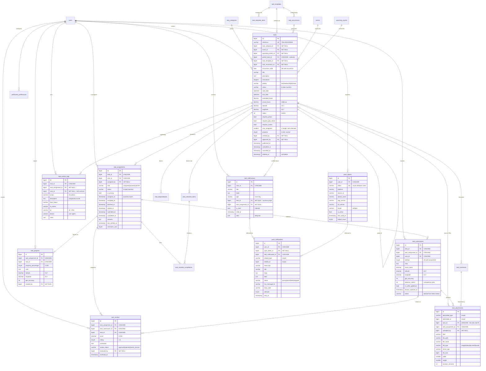

# Task Management — Entity Relationship Diagram

Companion to [TASK_MANAGEMENT.md](TASK_MANAGEMENT.md), which explains *why* the
schema is shaped this way. This file is the map.

**18 tables**: 16 new, plus two existing ones extended
(`push_tokens`, `users`).

---

## 1. Full ERD

---

## 2. Table inventory

| # | Table | Cols | Index parts | Purpose |
|---|---|---|---|---|
| 1 | `task_categories` | 10 | 4 | Planting, Watering, Pruning, Survey |
| 2 | `tasks` | 36 | 21 | The work item |
| 3 | `task_assignments` | 18 | 14 | Who is on it, and their own clock |
| 4 | `task_checklist_items` | 9 | 3 | The steps |
| 5 | `task_checklist_completions` | 8 | 5 | Who ticked what |
| 6 | `task_submissions` | 16 | 9 | One attempt, with proof-of-presence |
| 7 | `task_progress` | 11 | 6 | Interim "40% done" reports |
| 8 | `task_reviews` | 12 | 10 | An admin's verdict |
| 9 | `task_attachments` | 17 | 8 | Photos, videos, documents, audio |
| 10 | `task_comments` | 10 | 6 | Discussion + staff-only notes |
| 11 | `task_notifications` | 12 | 8 | In-app inbox |
| 12 | `task_activity_logs` | 13 | 9 | The audit trail |
| 13 | `task_dependencies` | 6 | 4 | "Cannot start until…" |
| 14 | `task_templates` | 18 | 5 | Reusable blueprints |
| 15 | `task_template_items` | 9 | 3 | Blueprint checklist |
| 16 | `task_recurrences` | 22 | 4 | Schedules that generate tasks |
| 17 | `push_tokens` *(extended)* | 14 | 7 | Device registry |
| 18 | `push_notifications` | 18 | 12 | FCM delivery log |
| — | `notification_preferences` | 7 | 4 | Per-event opt-outs |

---

## 3. Cascade rules at a glance

The governing rule: **operational data cascades, evidence does not.**

| Parent removed | Cascades away | Set to NULL (survives) |
|---|---|---|
| `tasks` (force delete) | assignments, submissions, progress, reviews, checklist, comments, attachments, activity logs | `task_notifications.task_id` |
| `task_assignments` | submissions, progress, reviews, checklist completions, attachments | `task_activity_logs.task_assignment_id`, `task_notifications.task_assignment_id` |
| `task_submissions` | reviews, attachments (via app-level hook) | — |
| `users` | their assignments, submissions, push tokens, notifications, preferences | `tasks.created_by`, `tasks.approved_by`, `task_reviews.reviewed_by`, `task_progress.created_by`, `task_activity_logs.user_id`, `task_attachments.uploaded_by` |
| `task_categories` | — | `tasks.task_category_id` |
| `events` / `upcoming_events` | — | `tasks.event_id`, `tasks.upcoming_event_id` |
| `task_templates` | template items, recurrences | `tasks.task_template_id` |

Three deliberate exceptions:

1. **`task_activity_logs.user_id` is SET NULL.** An audit trail that can be
   rewritten by deleting an account is not an audit trail.
2. **`task_notifications.task_id` is SET NULL.** A purged task must not silently
   empty entries out of someone's inbox.
3. **`task_attachments` needs application-level cleanup.** A polymorphic relation
   has no foreign key for the database to cascade, and files must be unlinked
   from disk anyway. `task_id` is the table's only real FK and exists precisely
   so no row can orphan; `HasTaskAttachments` handles the files.

Soft deletes on `tasks` and `task_comments` never touch files or cascade —
a restorable record must come back intact.

---

## 4. Uniqueness constraints that enforce correctness

| Constraint | Prevents |
|---|---|
| `tasks (reference)` | Ambiguous references when quoted over the phone |
| `tasks (task_recurrence_id, occurrence_date)` | A scheduler that runs twice duplicating an occurrence |
| `task_assignments (task_id, user_id, role)` | Assigning the same person twice |
| `task_submissions (task_assignment_id, attempt)` | A double-tapped submit button creating two review rows |
| `task_checklist_completions (item, assignment)` | Duplicate ticks — makes the endpoint an idempotent upsert |
| `task_dependencies (task_id, depends_on_task_id)` | Duplicate edges |
| `task_categories (slug)` | Ambiguous category lookups |
| `push_tokens (token)` | One phone registered twice; forces the row to **move** between users |

---

## 5. Index strategy

Every index exists for a named query. No speculative indexes — each one costs
write throughput and disk.

| Index | Serves |
|---|---|
| `tasks (status, due_date)` | Admin queue: open work, soonest deadline |
| `tasks (priority, status)` | Triage board |
| `tasks (due_date, status)` | Overdue sweep |
| `tasks (latitude, longitude)` | Map bounding box |
| `task_assignments (user_id, status)` | **"My Tasks"** — the hottest query in the app |
| `task_assignments (user_id, assigned_at)` | Volunteer workload by month |
| `task_assignments (status, last_notified_at)` | Reminder sweep |
| `task_submissions (status, created_at)` | Reviewer queue, oldest first |
| `task_progress (task_assignment_id, created_at)` | Progress trail |
| `task_reviews (review_status, reviewed_at)` | Quality dashboard |
| `task_reviews (reviewed_by, reviewed_at)` | A reviewer's own output |
| `task_attachments (task_id, file_type)` | Reviewer's gallery |
| `task_notifications (user_id, is_read)` | Unread badge count |
| `task_activity_logs (task_id, created_at)` | Task timeline |
| `task_activity_logs (action, created_at)` | "Everything approved last month" |
| `push_tokens (user_id, is_active)` | Push fan-out |
| `push_notifications (status, created_at)` | Delivery worker's queue |
| `task_recurrences (is_active, next_run_at)` | Generator's only query |

**Composite column order follows selectivity:** the equality-filtered column
leads, the range or sort column follows — `(user_id, status)` not
`(status, user_id)`, because every "My Tasks" query pins `user_id` and then
filters status.

---

## 6. Future scalability

**Where the growth is.** Three tables grow without bound while the rest scale
with the number of tasks:

| Table | Growth driver | Plan |
|---|---|---|
| `task_activity_logs` | ~10–15 rows per task lifecycle | First archival candidate. Partition by `created_at` or roll off to cold storage annually. Nothing reads beyond ~90 days except audits. |
| `push_notifications` | 1 row per device per event | Prune `sent` rows older than 30 days; keep `failed` for diagnosis. |
| `task_progress` | Unbounded — volunteers can report freely | Only the latest row per assignment feeds the roll-up; older rows are history. Safe to thin. |

**Already designed for scale:**

- **Cached roll-ups.** `tasks.progress` and `tasks.actual_hours` are
  denormalised. Every list screen reads them; only the report and review actions
  write them. Without this, each row in a task list would aggregate its children.
- **Write-time computation.** `task_submissions.distance_meters` is calculated
  once at submit, so the review queue never runs trigonometry over thousands of
  rows.
- **Denormalised `task_id`** on progress, reviews and attachments: the task
  timeline and gallery need no joins, and it doubles as the orphan guard.
- **Bounded recurrence.** `max_occurrences` means a misconfigured rule cannot
  flood the table.
- **Push is an outbox.** Rows are written `queued` and drained by a worker, so an
  FCM outage delays pushes rather than losing them.
- **VARCHAR + PHP enums, not MySQL ENUM.** Adding a status is a code-only deploy,
  not an `ALTER TABLE` with a write lock on a large table.

**When the geofence query becomes hot**, replace the composite
`(latitude, longitude)` B-tree with a `POINT` column and a `SPATIAL` index. The
application already refines candidates client-side, so the change is contained
to `Task::scopeWithinBounds()`.

---

## 7. Verified

Against MySQL 8, on a throwaway database:

- All six migrations apply, roll back, and re-apply cleanly. Rollback leaves the
  pre-existing `push_tokens` table exactly as it was.
- **283 assertions across four smoke suites, all passing** — tasks (58),
  assignments (65), attachments (71), tracking (89).
- `RolesAndPermissionsSeeder` seeds 30 task permissions across the five roles.
- Existing test suite unchanged: 32 passing.
